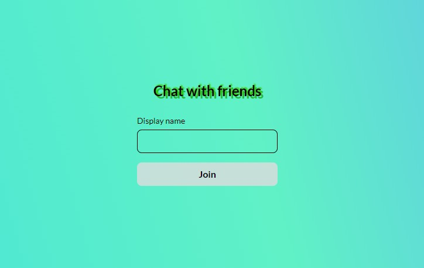

# chatkript-chat-app

Real-time chat aplication developed as part of Algebra's Frontend developer course.

[**Try me on Netlify**](https://marlxton-chat-app.netlify.app/)

---

## Getting started

**Technologies**

- JavaScript
- React
- SCSS
- Scaledrone

**Requirements**

- Node.js 16.15.0+
- npm 8.5.5+
- Scaledrone channel ID

**First steps**

1. Clone this repository
2. Run `npm install`
3. Run `npm start`

## Scripts

### `npm run start`

Start the development environment.

### `npm run build`

Build the project for production.

## Features

- [x] Create text messages
- [x] Send text message by pressing "Enter" or the submit button (message is shown next to the name of the author)
- [x] Every chat room member is identifiable by name and colour
- [x] Integrate with Scaledrone to provide real-time chat functionality
- [x] Host as GitHub repository

## Roadmap

- [ ] "Typing..." indicator
- [ ] Log out button
- [ ] Emoji keyboard
